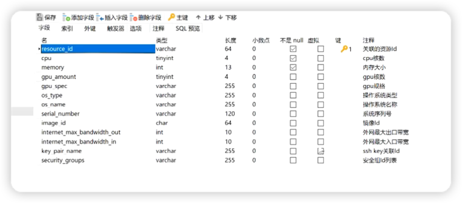

# 主机录入模块

## 资源的统一搜索表结构



## 资源标签管理


### 应用标签

应用在部署时 需要申请对应的资源, 申请完成后 需要补充标签:

比如 deploy
+ deploy = "app1-v1"
+ deploy = "app2-v1"


### 监控标签

我们使用2个标签:
+ prometheus.io/node/enabled = "true"
+ prometheus.io/node/endpoint = "9100:/metrics"
+ prometheus.io/node/endpoint = "9200:/metrics"

+ prometheus.io/appv1/enabled = "true"
+ prometheus.io/appv1/endpoint = "9100:/metrics"
+ prometheus.io/appv1/endpoint = "9200:/metrics"

比如搜索 prometheus.io/%/enabled = "true"

```json
[
    {
        "targets": ["10.0.10.2:9100", "10.0.10.3:9100", "10.0.10.4:9100", "10.0.10.5:9100"],
        "labels": {
            "domain": "admin",
            "namespace": "default",
            "env": "prod",
            "accout": "acount11",
            "vendor": "ali_yun",
            "region": "hangzou",
            "instance_id":"ins-xxxxx"
        }
    },
    ...
]
```

## 资源生命周期管理


### 资源申请

### 资源释放逻辑

create cluster app-v1
devcloud.com/deploy = app-v1
[h1, h2, bucket1, mysql01, dba]

资源状态

+ 3天的 滞留期, 资源无人使用的最大窗口,
+ 超过3天都未使用, 将进入待观察期(4天),  资源会停止服务
+ 当资源超过观察期都还未有人处理，会直接释放, 并记录资源状态 (记录保存期,365天)